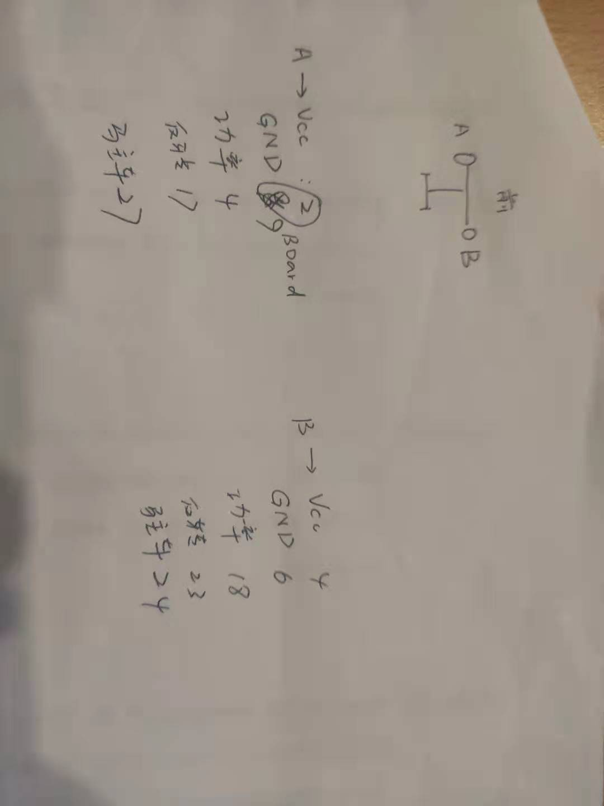

# Automatic-Following-Truck

自动跟随搬运小车

## GPIO assignment

|      Component | Function | GPIO | Pin  |
| -------------: | :------- | :--- | ---- |
|  A: left wheel | GND      |      | 9    |
|                | POWER    | 4    |      |
|                | REVERSE  | 17   |      |
|                | PARK     | 27   |      |
|                | VCC      |      | 2    |
|                |          |      |      |
| B: right wheel | GND      |      | 6    |
|                | POWER    | 18   |      |
|                | REVERSE  | 23   |      |
|                | PARK     | 24   |      |
|                | VCC      |      | 4    |
|                |          |      |      |
|            UWB | GET_A    | 1    |      |
|                | GET_B    | 2    |      |
|                |          |      |      |
|   LineSensor_0 | OUT      | 5    |      |
|   LineSensor_1 | OUT      | 6    |      |
|   LineSensor_2 | OUT      | 7    |      |
|   LineSensor_3 | OUT      | 8    |      |

